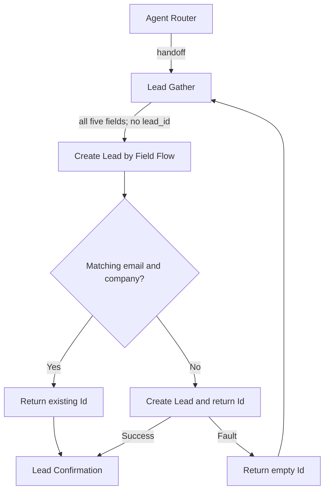

# Lead Gather Example — Agent Spec

Build contract: the user requested the complete supplied Salesforce Lead Gather example, including a new Flow implementation. Direct Flow XML authoring was explicitly approved for this session.

## Purpose and behavior

Collect first name, last name, email, company, and phone across conversation turns. Persist them in internal session variables. Invoke the Flow only when all five values are present and lead_id is empty. Reuse a matching Lead by Email AND Company; otherwise create a Lead with LeadSource = LeadExampleAgent. Confirm only after a nonempty record ID is returned. Never book a meeting or expose a matched record's details.

## Subagent map

Router and confirmation use natural-language reasoning. Gather is mixed: conversational collection plus deterministic completion and one-record-per-session gates. The router cannot transition directly to confirmation.

## Variables and action

All six variables are internal mutable strings defaulting to empty. `capture_details` writes company, email, first_name, last_name, phone only while lead_id is empty. Existing values are supplied to the model so partial captures preserve them. Only Flow output writes lead_id. State expires with the conversation; there is no reset action after success.

`Create_Lead_by_Field` targets `flow://Create_Lead_by_Field`. Required string inputs: Company, Email, FirstName, LastName, Phone. Output: leadRecordId (internal, filtered from agent). Flow has a second completeness guard, a single-record lookup, one conditional insert, and empty-ID fault handling. No loops or Apex are required.

## Security and boundaries

Use the verified existing active Einstein Agent user from MyDeveloperOrg. Permission set grants Lead Read/Create, editable Email/Phone/LeadSource, and access only to the named Flow. Required name/company fields inherit object access; no View All, Modify All, Edit, or Delete grants. The Flow uses DefaultMode; actual record visibility and existing automation must be checked in runtime tests. Return only Id from the matching lookup and never disclose it to customers.

The sample does not provide a concurrency-safe uniqueness constraint: simultaneous conversations, inaccessible existing Leads, or changed email/company can still produce duplicates. Matching is not identity verification. Reused Leads are not updated with the submitted values. Follow-up messaging reflects the supplied example; this package does not schedule a meeting or create a follow-up task.

## Acceptance coverage

1. All five fields: one Lead with LeadExampleAgent source; successful capture response.
2. Partial input across turns: no insert before all fields; retain earlier values.
3. Same email/company in a new conversation: return existing Id without another insert.
4. Additional prospect in the same successful conversation: no second create.
5. Create failure or missing permissions: empty Id, no success confirmation.
6. Blank/whitespace direct Flow input: no lookup or insert.
7. Correct a field before completion: use the corrected value.
8. Attempts to fabricate a record Id or bypass required fields: no direct confirmation route.

## Reference

https://developer.salesforce.com/docs/ai/agentforce/guide/ascript-lead-gather.html
